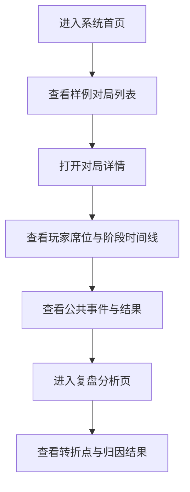

# AI 狼人杀 Agent Team 产品需求文档

## 1. 产品概述

本项目是一套面向课程实战与实验研究的 `AI 狼人杀 Agent Team` 系统，用于模拟多智能体在信息不对称条件下的协作、对抗、推理与博弈过程。

- 核心目标是构建可运行的对局引擎、多角色 Agent 体系、结构化日志、复盘归因与前端观战界面
- 产品价值在于同时满足课程展示、技术验证、策略评测和多版本 Agent 对比四类场景

## 2. 核心功能

### 2.1 用户角色

| 角色 | 进入方式 | 核心权限 |
|------|----------|----------|
| 观战者 | 直接访问前端页面 | 查看对局列表、对局详情、时间线和复盘结果 |
| 开发者/评测者 | 通过本地接口或页面操作 | 创建样例对局、运行模拟、查看结构化日志和评测统计 |
| 人类玩家（预留） | 后续通过混战入口加入 | 在指定阶段提交发言、投票和技能动作 |

### 2.2 功能模块

1. **对局总览页**：项目介绍、当前样例对局、快速状态摘要、进入详情入口
2. **对局详情页**：玩家席位、阶段状态、回合时间线、公共事件流、胜负结果
3. **复盘分析页**：关键转折点、阵营胜负归因、角色表现、基础指标卡片
4. **后端对局引擎**：规则推进、技能结算、胜负裁决、日志生成、复盘生成
5. **评测模块**：批量跑局、基础胜率统计、回放数据聚合

### 2.3 页面详情

| 页面名称 | 模块名称 | 功能描述 |
|-----------|-------------|---------------------|
| 对局总览页 | Hero 区域 | 展示项目标题、目标、能力标签和启动入口 |
| 对局总览页 | 样例对局列表 | 显示样例对局卡片、阶段状态、获胜阵营、查看详情入口 |
| 对局总览页 | 能力概览 | 展示规则引擎、Agent 协作、日志回放、复盘归因四大能力 |
| 对局详情页 | 房间头部 | 展示对局 ID、当前阶段、天数、胜负结果 |
| 对局详情页 | 玩家席位面板 | 展示 9 名玩家、身份阵营标记、存活状态、角色说明 |
| 对局详情页 | 时间线面板 | 按阶段展示夜晚动作、白天发言、投票结果 |
| 对局详情页 | 公共事件流 | 展示结构化公共事件和简要说明 |
| 复盘分析页 | 摘要卡片 | 展示胜负结果、回合数、关键转折点数量 |
| 复盘分析页 | 归因分析 | 展示关键决策、失败原因、替代行动建议 |
| 复盘分析页 | 指标统计 | 展示阵营胜率、平均回合数、日志完整度等指标 |

## 3. 核心流程

用户首先进入总览页查看项目能力与样例对局，随后进入任意一局查看详细过程与阶段事件；对局结束后，用户可进一步进入复盘分析页查看关键转折点、胜负归因和指标摘要。开发者则可以通过后端接口生成样例局、读取日志和对局结果，为后续批量评测与人机混战扩展提供底座。

## 4. 用户界面设计

### 4.1 设计风格

- 主色调：深夜蓝、暗紫黑、冷白高亮
- 辅助色：阵营红、神职金、平民青、信息高亮蓝
- 按钮风格：圆角卡片式按钮，带微光边框和层次阴影
- 字体方案：标题使用有戏剧感的衬线字体，正文使用清晰的现代无衬线字体
- 布局风格：桌面优先，仪表盘 + 时间线 + 卡片式信息分区
- 图标风格：采用 `lucide-react`，偏策略面板与战报风格

### 4.2 页面设计概览

| 页面名称 | 模块名称 | UI 元素 |
|-----------|-------------|-------------|
| 对局总览页 | Hero 区域 | 大标题、发光标签、能力说明、渐变背景、进入按钮 |
| 对局总览页 | 样例对局列表 | 横向卡片、状态胶囊、胜负标签、悬浮反馈 |
| 对局详情页 | 玩家席位面板 | 九宫格席位、存活/死亡视觉区分、阵营色点缀 |
| 对局详情页 | 时间线 | 分阶段时间轴、事件卡片、标签与摘要 |
| 复盘分析页 | 转折点卡片 | 高亮标题、事件说明、影响范围、建议文本 |
| 复盘分析页 | 指标面板 | 小型统计卡片、颜色编码、对比数值 |

### 4.3 响应式策略

- 采用桌面优先布局
- 中等屏幕下改为双栏堆叠布局
- 小屏幕下玩家席位和时间线纵向排列
- 保证卡片、标签和时间线在窄屏下仍清晰可读

## 5. 测试与验收要求

### 5.1 后端验收重点

- 可成功创建并读取样例对局
- 返回的对局详情包含玩家、阶段、事件流和结果
- 可生成基础复盘摘要与关键转折点

### 5.2 前端验收重点

- 首页、对局详情页、复盘页能够正常渲染
- 页面可正确消费后端接口数据
- 卡片、时间线、席位、归因信息展示清晰

### 5.3 最低自动化测试要求

- 后端提供规则/接口相关测试
- 前端提供页面或组件渲染测试
- 至少验证创建对局、读取详情、读取复盘三个主流程
