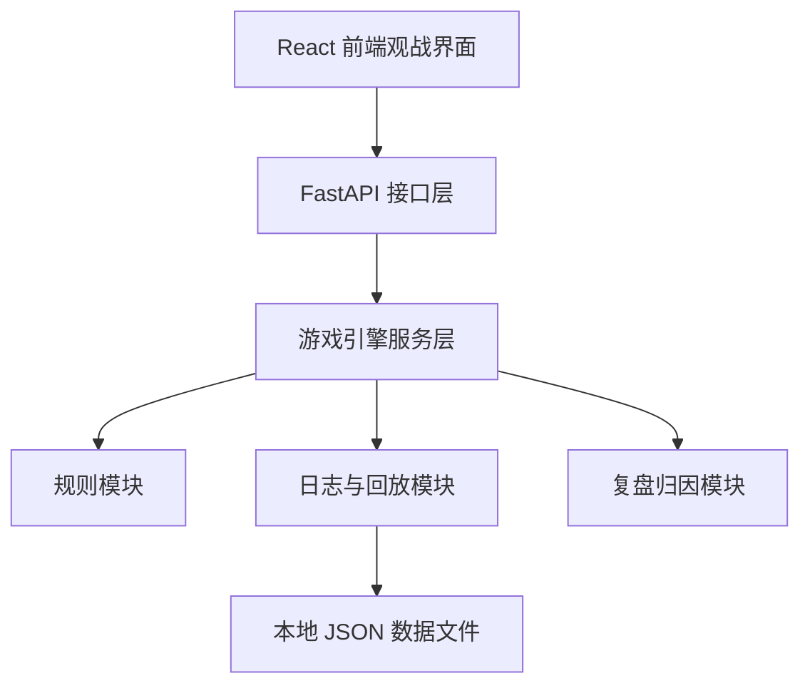
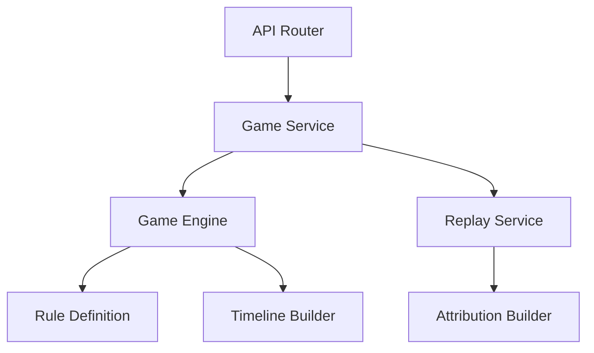
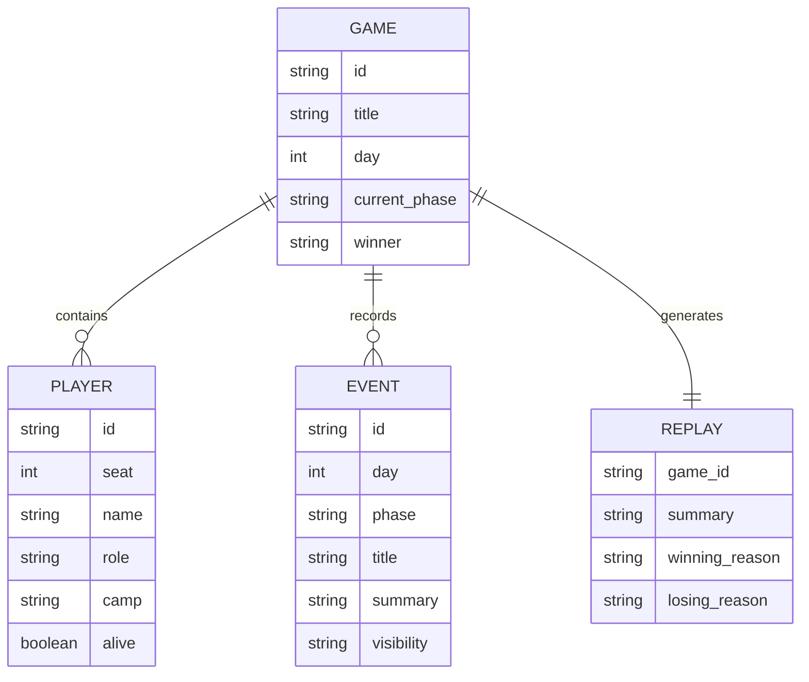

# AI 狼人杀 Agent Team 技术架构文档

## 1. 架构设计



## 2. 技术描述

- 前端：React 18 + TypeScript + Vite + Tailwind CSS + Zustand
- 后端：Python 3.11 + FastAPI + Pydantic
- 测试：Vitest + React Testing Library + Pytest
- 初始化方式：`vite-init` 创建前端项目，Python 虚拟环境管理后端依赖
- 数据存储：第一版使用内存数据结构 + 本地 JSON 样例文件

## 3. 路由定义

| 路由 | 用途 |
|------|------|
| `/` | 项目总览与样例对局列表 |
| `/games/:gameId` | 查看单局详情、玩家席位与时间线 |
| `/games/:gameId/replay` | 查看复盘摘要、关键转折点与归因分析 |

## 4. API 定义

### 4.1 TypeScript 类型定义

```ts
export type Camp = "werewolf" | "villager" | "god";

export interface PlayerSummary {
  id: string;
  seat: number;
  name: string;
  role: string;
  camp: Camp;
  alive: boolean;
}

export interface TimelineEvent {
  id: string;
  day: number;
  phase: string;
  title: string;
  summary: string;
  visibility: "public" | "private";
}

export interface GameSummary {
  id: string;
  title: string;
  currentPhase: string;
  day: number;
  winner: string | null;
}

export interface ReplayReport {
  summary: string;
  keyTurningPoints: string[];
  attribution: {
    winningReason: string;
    losingReason: string;
  };
}
```

### 4.2 接口清单

| 方法 | 路径 | 说明 |
|------|------|------|
| `GET` | `/api/health` | 健康检查 |
| `GET` | `/api/games` | 获取样例对局列表 |
| `POST` | `/api/games/sample` | 创建一局样例对局 |
| `GET` | `/api/games/{game_id}` | 获取单局详情 |
| `GET` | `/api/games/{game_id}/replay` | 获取复盘报告 |

### 4.3 响应示例

```json
{
  "id": "game_demo_001",
  "title": "样例对局 001",
  "currentPhase": "day_announce",
  "day": 2,
  "winner": "villager"
}
```

## 5. 服务端架构图



## 6. 数据模型

### 6.1 数据模型定义



### 6.2 数据定义说明

第一版不引入数据库，采用以下方式：

- 对局状态在后端内存中维护
- 样例对局和复盘数据可序列化为本地 JSON
- 后续若需要批量评测和历史检索，可迁移到 SQLite 或 PostgreSQL

## 7. 后端模块划分

- `app/models`：定义玩家、事件、对局、复盘等数据模型
- `app/rules`：定义 9 人局规则、角色阵营、胜负判定逻辑
- `app/engine`：负责初始化样例局、推进阶段、构造时间线
- `app/services`：封装对局查询、复盘生成和统计逻辑
- `app/api`：提供 FastAPI 路由

## 8. 前端模块划分

- `src/pages`：首页、对局详情页、复盘页
- `src/components`：导航头、状态卡、席位卡、时间线卡、归因卡
- `src/store`：管理对局列表、详情和复盘状态
- `src/types`：统一前后端共享的视图类型
- `src/utils`：接口请求和格式化方法

## 9. 测试策略

- 后端单元测试：验证样例对局初始化、胜负状态、复盘生成
- 后端接口测试：验证健康检查、对局列表、对局详情、复盘接口
- 前端组件测试：验证首页卡片、详情时间线、复盘摘要渲染
- 前端页面测试：验证路由切换和接口数据挂载

## 10. 实施顺序

1. 初始化前端 Vite React TypeScript 项目
2. 初始化 FastAPI 后端基础目录
3. 实现样例对局数据模型与接口
4. 实现首页、详情页、复盘页
5. 联调前后端
6. 补充自动化测试与基础验证
