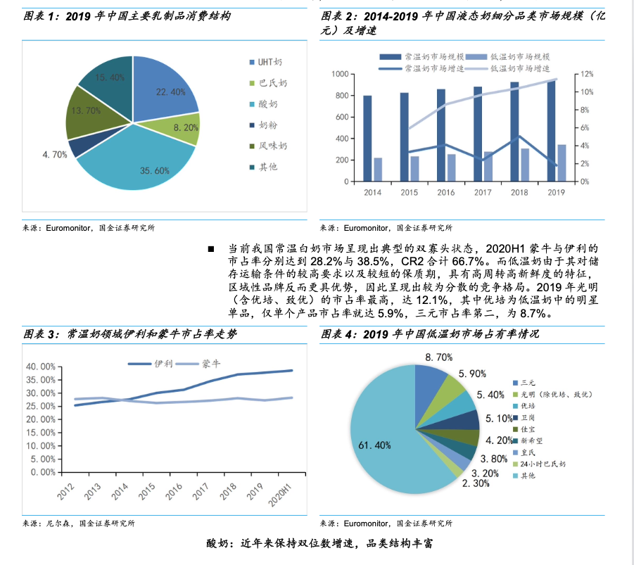

# 多模态 RAG 问答系统

## 项目背景

在信息爆炸的时代，人们获取知识的方式不再局限于纯文本，大量信息存在于图文混排的文档、网页、报告甚至图片库中。传统问答系统多基于纯文本，难以有效处理需要结合图像内容进行推理的复杂问题。例如，"这张图片里左边那个设备的功能是什么？""根据图表显示，产品 A 的销售额在哪个季度开始下降？"这类问题既要求理解自然语言，又要求"看懂"图像，并将两者关联推理。



RAG 范式扩展到多模态领域后，模型可从图文知识库中检索相关图像与文本片段，再综合生成准确答案，在企业知识管理、教育、医疗等领域具有应用前景。

## 项目任务

提供一个包含多个图文混排 PDF 的知识库，以及一组依赖文本与图像的测试查询。系统需要：

- 同时理解自然语言问题与知识库中的图文内容
- 跨模态高效检索图像、图表、文本段落或其组合
- 将图像信息与文本信息融合推理
- 生成准确、简洁的答案，并明确指出来源（PDF 名、页码、图表）

评估侧重答案准确性、完整性、关联性与可解释性。

## 系统架构

三个独立服务 + 共享中间件：

- **upload-api**（FastAPI，~10 并发）：接收 PDF 上传，落地到本地，向 Kafka 投递解析任务。
- **parse-worker**：消费 Kafka 任务，调用 MinerU 解析 PDF → Markdown + 图片文件，做分块、向量化，写入 Milvus 与 SQLite。
- **chat-api**（FastAPI）：接收用户提问，三路召回 + RRF + Reranker，调用 Qwen-VL 生成答案，流式返回。

为什么这样拆：

- MinerU 解析需 GPU，单文件约 1 分钟，必须异步化 → Kafka 解耦上传与解析。
- CLIP 只在检索阶段用，Qwen-VL 只在生成阶段用，分阶段加载省显存。
- 向量进 Milvus，元数据与任务状态进 SQLite，本地文件系统存原始 PDF / Markdown / 图片。

## 模型与组件

所有模型本地部署，不调用线上 API。代码通过环境变量预留路径占位，由用户填写：

| 用途 | 模型 | 环境变量 |
|------|------|----------|
| 文档解析 | MinerU | `MINERU_MODEL_PATH` |
| 文本编码 | BGE | `BGE_MODEL_PATH` |
| 图文编码 | Chinese-CLIP | `CLIP_MODEL_PATH` |
| 重排 | BGE-Reranker | `RERANKER_MODEL_PATH` |
| 多模态生成 | Qwen-VL | `QWEN_VL_MODEL_PATH` |

中间件：

- **SQLite**：知识库、文档、解析任务等元信息
- **Milvus**：向量存储与检索（拆两个 collection，见下文）
- **Kafka**：上传与解析之间的异步队列
- **本地文件系统**：原始 PDF、解析产出的 Markdown 与图片
- Qwen-VL v1 直接用 `transformers` 加载，跑通后再切 vLLM

## 检索与生成策略

**分块**：按自然语义边界递归切分，`chunk_size=500`，`overlap=50`。图像 chunk 与其周围说明文字（caption）一起 embed，不单独存。

**三路召回 → 融合 → 重排 → Top-10**：

| 路径 | 召回方式 | top-k |
|------|----------|-------|
| 文本全文 | BM25 | 100 |
| 文本语义 | BGE 向量 | 100 |
| 图文跨模态 | Chinese-CLIP 向量 | 50 |

三路结果用 RRF 算法融合，再用 BGE-Reranker 交叉编码器精排，最终取 Top-10 给 Qwen-VL。

**BM25 后端**：v1 用 `rank_bm25`（Python 库，内存索引），后续若需要持久化与大规模检索再切 Elasticsearch。

**生成上下文**：图 + caption 一起喂给 Qwen-VL，token 预算 4k；最多 3 张图、文本 ≤ 3000 token、输出 ≤ 1000 token。

## 数据模型

### SQLite 表结构

```sql
-- 知识库
knowledge_base(id, name, created_at)

-- 文档
document(id, kb_id, filename, local_path, page_count, created_at)

-- 解析任务
parse_task(id, doc_id, status, error_msg, created_at, updated_at)
-- status ∈ {pending, parsing, embedded, failed}
```

### Milvus Collections

BGE 与 Chinese-CLIP 维度不同，必须拆开：

- **`text_chunks`**（BGE 向量）：`id, kb_id, doc_id, page, chunk_idx, modality='text', content, embedding`
- **`image_chunks`**（Chinese-CLIP 向量）：`id, kb_id, doc_id, page, chunk_idx, modality='image', image_path, caption, embedding`

两个 collection 都按 `kb_id` 标量过滤，实现知识库级别隔离。

## 接口定义

### `POST /upload/document`

上传 PDF 到指定知识库。

```json
// 请求 (multipart/form-data)
file: <PDF binary>
kb_id: "kb_001"

// 响应
{
  "doc_id": "doc_abc123",
  "filename": "report.pdf",
  "status": "pending"
}
```

步骤：保存 PDF 到本地 → 写入 `document` 与 `parse_task` → 向 Kafka 投递解析任务。

### `GET /documents/{doc_id}/status`

查询解析进度，前端轮询用。

```json
{
  "doc_id": "doc_abc123",
  "status": "parsing",        // pending | parsing | embedded | failed
  "error_msg": null
}
```

### `POST /chat`

流式多轮问答，SSE 协议。

```json
// 请求
{
  "kb_id": "kb_001",
  "history": [
    {"role": "user", "content": "..."},
    {"role": "assistant", "content": "..."}
  ],
  "question": "图表里 Q3 销售额是多少？"
}

// 响应（SSE，逐 token 推送）
data: {"type": "token", "content": "根据"}
data: {"type": "token", "content": "图表"}
...
data: {"type": "citations", "items": [
  {"filename": "report.pdf", "page": 12, "chapter": "3.2 销售分析", "image_url": "/static/doc_abc123/figures/fig_3.png"}
]}
data: {"type": "done"}
```

约定：

- 多轮历史由**客户端传入**，服务端不存 session（v1 简化）。
- 引用结构独立返回，方便前端单独渲染。
- 图片以 URL 返回，由 FastAPI `StaticFiles` 把本地解析目录 mount 到 `/static/`。

### `parse-worker`（消费者）

不是 HTTP 接口，是 Kafka topic `doc_parse` 的消费者：

1. 拉取任务 → 更新 `parse_task.status = parsing`
2. MinerU 解析 PDF → Markdown + 图片文件
3. 切分 chunk → BGE / Chinese-CLIP 向量化 → 写入 Milvus
4. 更新 `parse_task.status = embedded`；失败则写 `failed` + `error_msg`

v1 失败不自动重试，用户重新上传即可。

## 评价方法

每个问题按三项加权：

- **页面匹配度**（0.25）：命中正确页码
- **文件名匹配度**（0.25）：命中正确 PDF
- **答案内容相似度**（0.5）：基于字符的 Jaccard 相似系数（`|A∩B| / |A∪B|`）

`/chat` 响应中的 `citations` 字段直接对应前两项评分依据，因此结构化字段必须准确。

测试集格式（JSONL）：

```json
{"question": "...", "expected_filenames": ["report.pdf"], "expected_pages": [12], "expected_answer": "..."}
```

## 启动

第一次运行需要先安装依赖、配置模型路径、起好中间件：

```bash
pip install -e ".[dev]"
cp .env.example .env       # 编辑 .env，填本地模型路径
docker compose up -d       # Kafka + Milvus(+etcd+minio) + Attu
python scripts/init_db.py
python scripts/init_milvus.py
```

跑测试（不依赖任何大模型权重，应当看到 78 passed）：

```bash
pytest tests/
```

启动三服务 + 前端，每个开一个终端：

```bash
uvicorn services.upload_api.entrypoint:app --port 8001
python -m services.parse_worker.main
uvicorn services.chat_api.entrypoint:app --port 8002
streamlit run services/streamlit_app/app.py
```

打开 streamlit 给的 URL（默认 http://localhost:8501），左侧上传 PDF，等左侧解析状态变成 `embedded` 后，主区开始问答。

跑评测：

```bash
python scripts/evaluate.py --testset eval/testset.jsonl --chat-url http://localhost:8002
```

## v1 范围与后续迭代

**v1 实现**：单用户、单机部署、本地文件存储、`rank_bm25` 内存索引、`transformers` 直接加载 Qwen-VL、解析失败手动重传、客户端管理多轮历史。

**后续迭代**：

- 多租户与权限管理
- vLLM 加速 Qwen-VL，Elasticsearch 替换 `rank_bm25`
- 对象存储（OSS/MinIO）替换本地文件
- Kafka 死信队列与自动重试
- 解析进度细化（百分比、当前页）

## 技术栈

Python · FastAPI · Kafka · Milvus · SQLite · MinerU · Chinese-CLIP · BGE · BGE-Reranker · Qwen-VL · `rank_bm25`
